# 💜 Anniversary Countdown

A beautiful, secure React countdown app deployed on AWS with cost-optimized infrastructure.


## 🌟 Live Demo

**🔗 [mattandbrittney.com](https://mattandbrittney.com)**

*Countdown to September 10, 2025 at 8:00 PM EST*

## ✨ Features

- 🎯 **Real-time Countdown** - Dynamic countdown with flip animations
- 🔐 **Secure by Design** - CloudFront-only access, no direct IP exposure
- 💰 **Cost Optimized** - ~$12/month AWS infrastructure
- 📱 **Responsive Design** - Beautiful on all devices
- 🚀 **Fast & Reliable** - Global CDN with SSL
- 🎨 **Modern UI** - Built with React 19 + Tailwind CSS

## 🏗️ Architecture

```mermaid
graph TB
    User[👤 User] --> CF[☁️ CloudFront<br/>SSL + CDN]
    CF --> DNS[🌐 Route53<br/>fargate.mattandbrittney.com]
    DNS --> FG[🐳 ECS Fargate<br/>anniversary-countdown]
    
    CF -.->|SSL Certificate| ACM[🔒 ACM Certificate<br/>*.mattandbrittney.com]
    FG -.->|Container Images| ECR[📦 ECR Repository]
    FG -.->|Logs| CW[📊 CloudWatch Logs]
    
    subgraph "🛡️ Security"
        SG[Security Group<br/>CloudFront IPs Only]
        FG --- SG
    end
    
    subgraph "💰 Cost: ~$12/month"
        direction TB
        COST1[Fargate: $10]
        COST2[CloudFront: $2]
    end
```



## 🚀 Quick Start

### Prerequisites
- Docker
- AWS CLI configured
- Terraform >= 1.0

### Local Development
```bash
# Clone the repository
git clone <repository-url>
cd Anniversary

# Install dependencies
npm install

# Start development server
npm run dev
```

### Docker Build
```bash
# Build the container
docker build -t anniversary-countdown .

# Run locally
docker run -p 80:80 anniversary-countdown
```

## 🔧 Infrastructure Deployment

The entire AWS infrastructure is managed with Terraform for reproducible deployments.

### Deploy to AWS
```bash
cd terraform

# Initialize Terraform
terraform init

# Review deployment plan
terraform plan

# Deploy infrastructure
terraform apply

# Update CloudFront with Fargate IP
./update-cloudfront-origin.sh
```

### Infrastructure Components

| Component | Purpose | Cost/Month |
|-----------|---------|------------|
| **ECS Fargate** | Container hosting (256 CPU, 512MB RAM) | ~$10 |
| **CloudFront** | SSL termination + global CDN | ~$2 |
| **Route53** | DNS management | Minimal |
| **ACM** | SSL certificates | Free |
| **ECR** | Container image storage | Minimal |

## 🛡️ Security Features

- **CloudFront-Only Access** - Direct IP access blocked via security groups
- **SSL/TLS Encryption** - End-to-end HTTPS with ACM certificates
- **AWS Managed Security** - Leverages AWS security best practices
- **Minimal Attack Surface** - Single-purpose container, restricted networking

## 🔄 Auto-Updates

The `update-cloudfront-origin.sh` script automatically:
1. Discovers the current Fargate task IP
2. Updates the DNS record for `fargate.mattandbrittney.com`
3. Ensures CloudFront routes traffic correctly

## 📱 Tech Stack

### Frontend
- **React 19** - Latest React with concurrent features
- **TypeScript** - Type-safe development
- **Tailwind CSS** - Utility-first styling
- **Vite** - Fast build tooling
- **Lucide React** - Beautiful icons

### Infrastructure
- **AWS ECS Fargate** - Serverless containers
- **AWS CloudFront** - Global CDN with SSL
- **AWS Route53** - DNS management
- **Terraform** - Infrastructure as Code
- **Docker** - Containerization
- **Nginx** - Static file serving

## 💸 Cost Optimization

This deployment prioritizes cost efficiency:

- **Single AZ Deployment** - Reduced networking costs
- **Minimal Fargate Resources** - 256 CPU / 512MB RAM
- **Direct Container Access** - No load balancer overhead
- **Efficient Caching** - CloudFront reduces origin requests

**Previous ALB-based architecture:** ~$46/month  
**Current optimized architecture:** ~$12/month  
**💰 Savings:** ~$34/month (74% reduction)

## 🎯 Target Date

**September 10, 2025 at 8:00 PM EST**

*The countdown reveals special content when the target date is reached.*

## 📄 License

This is a personal project for Matt & Brittney's anniversary celebration.

---

*Built with ❤️ for a special anniversary*
